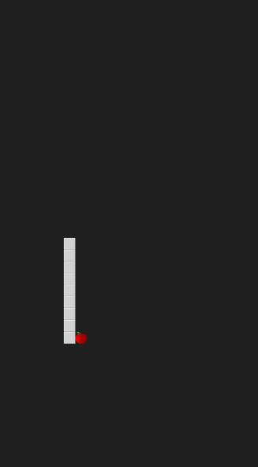

# 2DSnake
* This is a sample unity project, its a 2D snake game algorithm.

# How it works
* Snake is the common name for a video game concept where the player maneuvers a line which grows in length, with the line itself being a primary obstacle. 

### Photos of The Game

   
 

